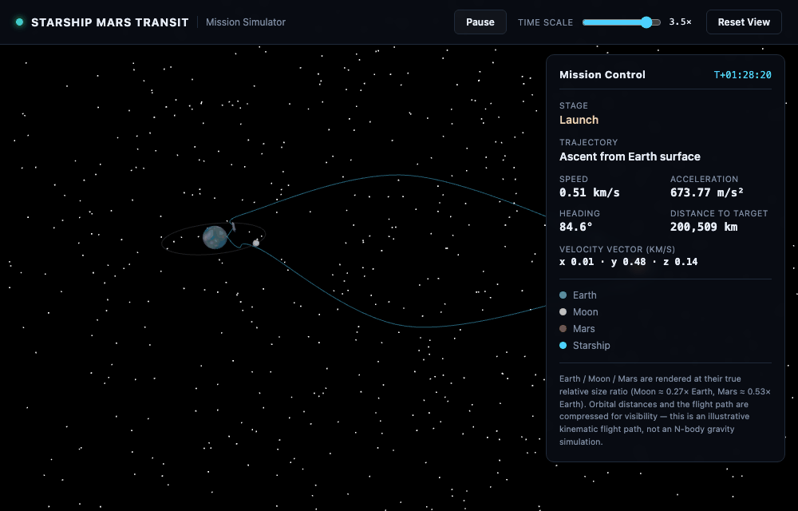

<h1 align="center">Sarah Beltran </h1>

<i>Physics student and AI Domain researcher, publishing projects undertaken in both my Finance and Astrophysics sectors of work.</i>

 

##  Finance Projects

### [MSFT Algo Trader](https://github.com/SaraMarubel/msft-algo-trader)
Real-time simulated candlestick chart trading from market open, with a tunable SMA/RSI algorithmic strategy that enables it on any of AAPL, GOOGL, AMZN, NVDA, and META, inspect the strategy logic and set your own parameters, issue TWAP "dump position" / "accumulate" commands, and track it all against a live NYSE market clock. Also updates user on financial reasoning pathway consideration, with text output, for legible guidance.

<a href="https://saramarubel.github.io/msft-algo-trader/">🔗 Live demo</a>

### [LIVE Updating Equity Research Report — TSMC](https://github.com/SaraMarubel/equity-research-report)
An equity research report on TSMC (NYSE: TSM) structured the way a sell-side or quant research desk would actually cover it: business model and structural analysis (foundry economics, process-node roadmap, supply-chain dependencies), a live peer-comparison table benchmarking TSMC against Intel, Samsung Electronics, GlobalFoundries, UMC, and ASML on valuation multiples and margins, and a quantitative risk profile computing beta against both the S&P 500 and the SOXX semiconductor index, annualized volatility, Sharpe ratio, max drawdown, and cross-asset return correlation directly from price history — plus the geopolitical, regulatory, and environmental risk sections most retail-style dashboards skip entirely. Live market, valuation, and peer data is pulled through the Yahoo Finance API via the `yfinance` Python library, with a topic-grouped live news feed sourced from the NewsAPI.org REST API; both are refreshed automatically every four hours by a cron-scheduled GitHub Actions workflow that commits fresh JSON straight to the repo. The frontend is hand-written HTML/CSS/vanilla JS with no framework or build step, rendering its own canvas-based charts and a hover-triggered glossary client-side.

<a href="https://saramarubel.github.io/equity-research-report/">🔗 Live demo</a>

### [ETF Basket Analysis](https://github.com/SaraMarubel/ETF-basket-analysis)
A trading-desk-style dashboard covering the 20 largest ETFs by assets under management, computing the same risk metrics a real trading desk tracks — beta and volatility against the S&P 500, Sharpe ratio, max drawdown, tracking error versus each fund's own benchmark index, live bid-ask spreads, and an options-market snapshot (implied volatility, open interest, put/call ratio) — alongside a 20×20 cross-fund correlation matrix, a side-by-side comparison tool with holdings-overlap percentage, and full sector/top-10-holdings composition breakdowns. Every fund also carries a written profile (manager, structural success factors, political/policy exposure) and a live, topic-grouped news feed. All market, risk, and options data is pulled through the Yahoo Finance API via `yfinance`, with live news from the NewsAPI.org REST API; both refresh automatically every 4 hours via a scheduled GitHub Actions workflow. Built with vanilla HTML/CSS/JS — sortable/filterable grid, hover-triggered glossary, light/dark theming, and a print-ready one-pager per fund, no framework or build step.

<a href="https://saramarubel.github.io/ETF-basket-analysis/">🔗 Live demo</a>

 

##  Astrophysics Projects

### [Galaxy Classification](https://github.com/SaraMarubel/galaxy-classification)
Classifies stars, galaxies, and black holes using real astrophysical techniques — the 21 cm hyperfine line for galaxy rotation, effective temperature for stellar spectral typing, and mass / Schwarzschild radius for black hole size classes.

### [Starship Mars Transit — Mission Simulator](https://github.com/SaraMarubel/starship-mars-transit)
A live 3D mission simulator (Three.js): a Starship-style vehicle flies Earth → Mars orbit → Earth on a black-space background, with Earth/Moon/Mars rendered at their true relative size ratio and a mission-control sidebar tracking stage, speed, acceleration, heading, and velocity in real time.

<a href="https://saramarubel.github.io/starship-mars-transit/">🔗 Live demo</a>

 

## 🧪 Other builds

### [Customer Interface System — Marubel Pizza's](https://github.com/SaraMarubel/Customer-Interface-system1)
A full pizza-ordering flow demo: branch finder, custom pizza builder, cart, itemised receipt, and a simulated checkout.

<a href="https://saramarubel.github.io/Customer-Interface-system1/">🔗 Live demo</a>

 

---

All finance projects above use simulated/paper trading or free public data — none connect to a live brokerage or real funds.

