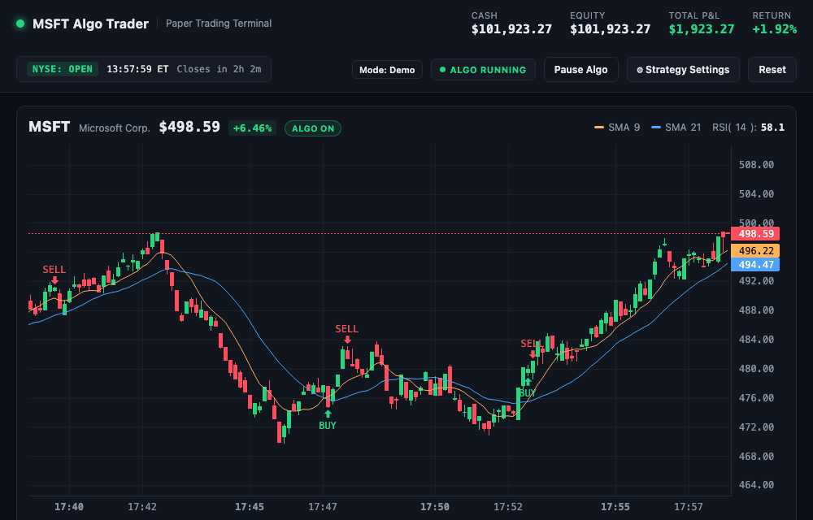
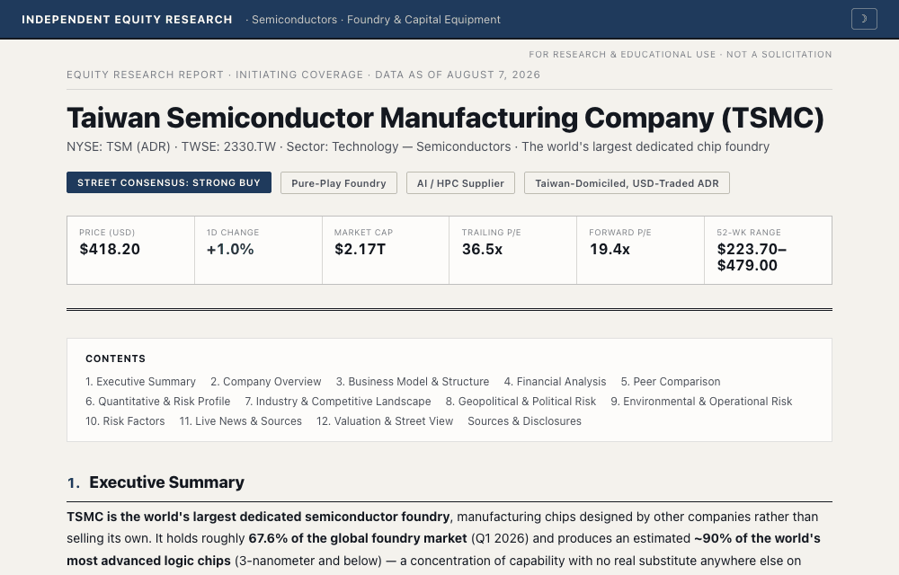
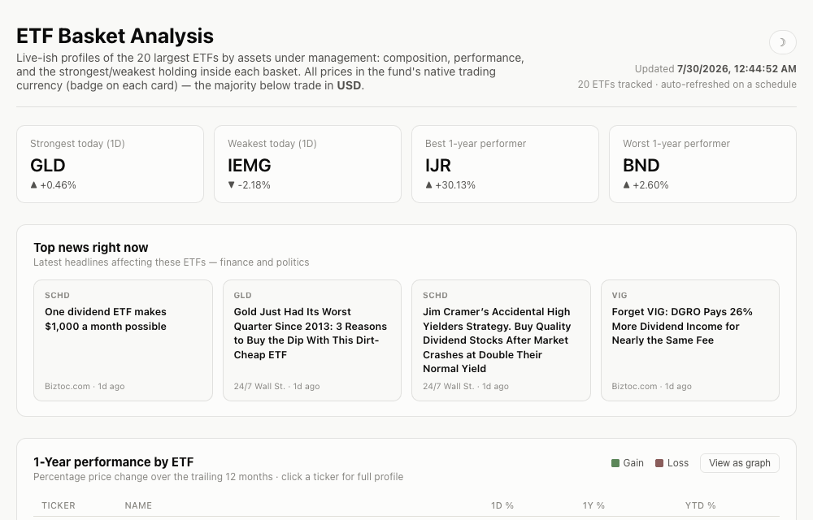
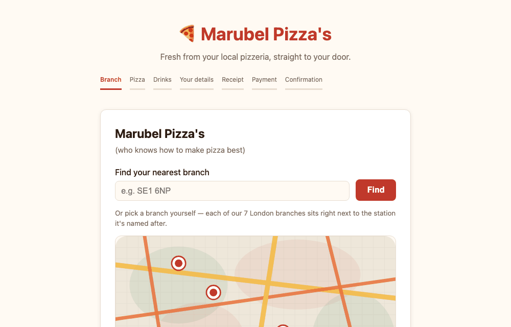

<h1 align="center">Sarah Beltran </h1>

<i>Physics student and AI Domain researcher, publishing projects undertaken in both my Finance and Astrophysics sectors of work.</i>

 

##  Finance Projects

### [MSFT Algo Trader](https://github.com/SaraMarubel/msft-algo-trader)
Real-time simulated candlestick chart for Microsoft with an SMA(9/21) + RSI algorithmic strategy that auto-trades paper positions, plus a broader tech portfolio view across AAPL, GOOGL, AMZN, NVDA, and META.

<a href="https://saramarubel.github.io/msft-algo-trader/">🔗 Live demo</a>

### [LIVE Updating Equity Research Report — TSMC](https://github.com/SaraMarubel/equity-research-report)
A full narrative equity research report on TSMC — business model, financials, competitive landscape, and geopolitical risk — built as a live static webpage instead of a downloadable PDF.

<a href="https://saramarubel.github.io/equity-research-report/">🔗 Live demo</a>

### [ETF Basket Analysis](https://github.com/SaraMarubel/ETF-basket-analysis)
A trading-desk-style dashboard covering the 20 largest ETFs by AUM: composition, risk/trading metrics, a cross-fund correlation matrix, and a side-by-side comparison tool.

<a href="https://saramarubel.github.io/ETF-basket-analysis/">🔗 Live demo</a>

 

##  Astrophysics Projects

### [Galaxy Classification](https://github.com/SaraMarubel/galaxy-classification)
Classifies stars, galaxies, and black holes using real astrophysical techniques — the 21 cm hyperfine line for galaxy rotation, effective temperature for stellar spectral typing, and mass / Schwarzschild radius for black hole size classes.

 

## 🧪 Other builds

### [Customer Interface System — Marubel Pizza's](https://github.com/SaraMarubel/Customer-Interface-system1)
A full pizza-ordering flow demo: branch finder, custom pizza builder, cart, itemised receipt, and a simulated checkout.

<a href="https://saramarubel.github.io/Customer-Interface-system1/">🔗 Live demo</a>

 

---

All finance projects above use simulated/paper trading or free public data — none connect to a live brokerage or real funds.

